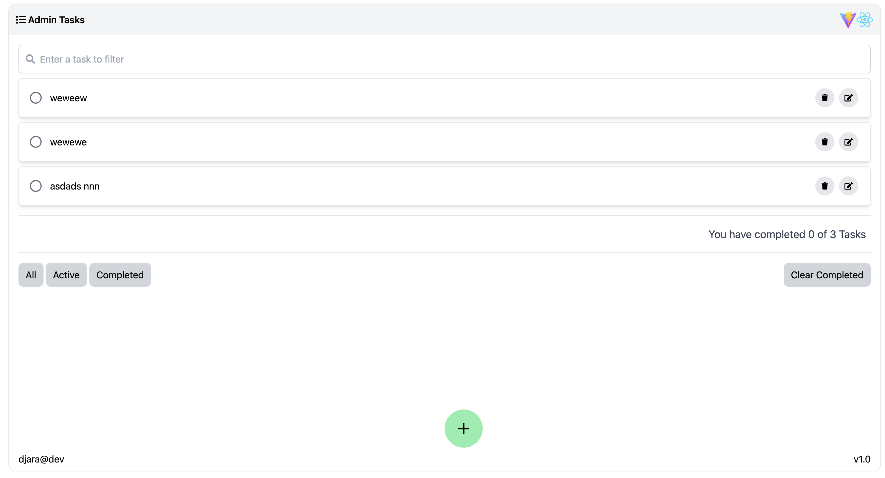

#### App Tasks with React

# Aplicación Administracion de tareas

### Descripción

```
En esta aplicacion, se realizan prácticas usando el framework de React.
Además establecemos una conexion con ApiREST.

```

### ApiREST

```
https://dummyjson.com/docs/todos
```

### Tecnología

- TailwindCss
- Vite
- React

### Demo App of Tasks

```
https://djaraweb.github.io/app-tasks-with-react
```

### Deploy App in gh-pages

```
npm run deploy-gh-pages
```

## Frontend de la Aplicacion



### Compila y recarga los archivos en modo Desarrollo

```
npm run dev
```
